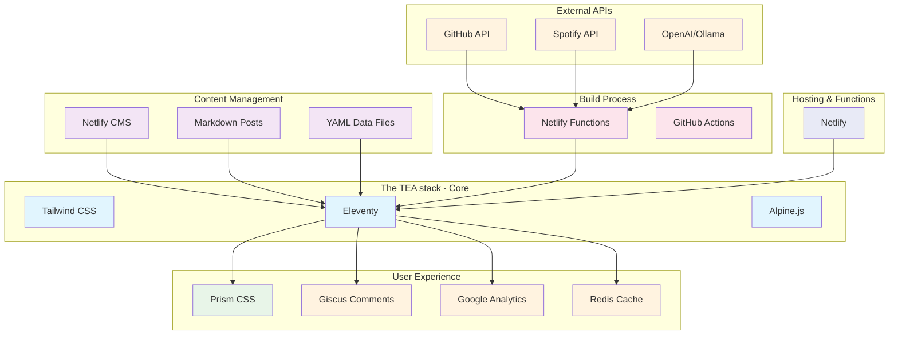

When I moved away from Jekyll a couple years ago, I didn't expect to end up with what I now call the "TEA" framework. It wasn't planned - it just evolved as I added features and tried to keep things simple. TEA stands for **Tailwind, Eleventy, and Alpine** (with Netlify as the hosting), but honestly, it started as just "I want to write Markdown and have a fast website."

*Disclaimer: This TEA has no affiliation with actual tea, though it pairs surprisingly well with a good cup*

## The Stack That Just Happened

Here's the thing about my setup - I didn't sit down and architect this system. I started with Eleventy because it felt the most like Jekyll (which I was migrating from), added Tailwind because writing CSS is painful, discovered Alpine.js when I needed some JavaScript sprinkles, and Netlify just made deployment ridiculously easy.



The beauty is that each piece does one thing well, and I can swap them out if needed. It's like building with LEGO blocks instead of casting concrete.

## The Three Pillars (That I Accidentally Discovered)

### Eleventy - The Steady Foundation

I picked Eleventy because migrating from Jekyll was supposed to be "easy." Spoiler: it wasn't exactly easy, but it was worth it. What I love about 11ty is that it doesn't fight me and grew organically as I needed features.

### Tailwind - The CSS That Made Sense

Yes, your HTML looks like alphabet soup, but you know what? I can style a component in minutes without switching files or thinking of clever class names.

### Alpine.js - JavaScript Without the Drama

Alpine.js gives me just enough JavaScript to make things interactive without turning my simple site into a SPA. Here's my actual dropdown navigation:

```html
<div x-data="{ open: false }" @click.away="open = false">
  <button @click="open = !open">Menu</button>
  <div x-show="open" x-transition>
    <!-- Menu items -->
  </div>
</div>
```

That's it. No build step, no virtual DOM, no existential crisis about state management.

### Netlify - Deploy and Forget (The Perfect Host for TEA)

I push to GitHub, and 30 seconds later my site is live. Netlify Functions let me add server-side features without actually managing a server. My upvote system? It's just a function that talks to Redis:

```javascript
// netlify/functions/upvote.js - The whole thing
exports.handler = async function(event) {
  const { slug } = JSON.parse(event.body);
  const count = await redis.incr(`upvotes:${slug}`);
  return { statusCode: 200, body: JSON.stringify({ count }) };
}
```

## The Ecosystem That Grew Around It

What started as a simple blog somehow accumulated a bunch of features. Here's what's actually running under the hood:

### Content & Data Flow

My content comes from everywhere:
- **Markdown files** for posts (obviously)
- **Netlify CMS** for when I want a GUI
- **GitHub API** to show my repos automatically  
- **Spotify API** because I wanted people to know what I'm listening to
- **Upstash Redis** to store upvotes (because why not?)
- **OpenAI/Ollama** for the quote of the day

### The Features That Snuck In

**Image Optimization**: Because I'm too lazy to manually resize photos
**Syntax Highlighting**: PrismJS with copy buttons because I write code tutorials
**Comments**: Giscus using GitHub issues (genius, really)
**Search**: Client-side search through snippets because databases are overrated
**Dark Mode**: Because it's 2025 

## The Honest Truth About Performance

My site scores not too bad on Lighthouse, but let me be honest about why:
- **It's mostly text**: No heavy JavaScript frameworks
- **Static files**: Everything's pre-built and served from a CDN
- **Lazy loading**: Images load when you scroll to them
- **Aggressive caching**: Netlify handles this automatically

The "performance optimizations" are mostly just the nature of static sites. I didn't have to think about it much.

## What I'd Do Differently

If I started over tomorrow:
1. **Better image organization**: My `/img` folder is chaos
2. **More consistent naming**: Some files are kebab-case, others aren't
3. **Testing**: I just... don't have any automated tests 😅

<!-- ## Why This Works for Me

This setup hits the sweet spot for a personal site:
- **Fast enough**: Sub-second loading
- **Simple enough**: I can understand everything
- **Flexible enough**: Easy to add new features
- **Cheap enough**: Basically free hosting
- **Fun enough**: I actually enjoy working on it -->

## Final Thoughts

I called it TEA because the acronym worked out (and because everything's better with tea), but really it's just a collection of tools that solve my specific problems.

*If you're curious about any specific part of this setup, just ask in the comments.*
